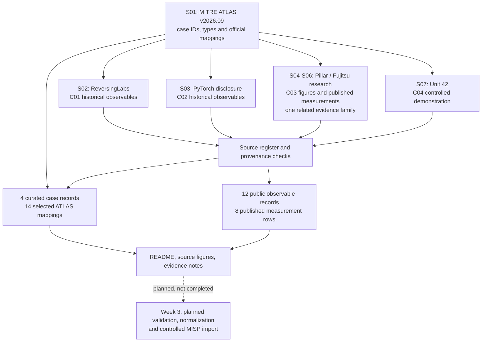

# Week 2 — Data Collection Process
## AI Supply Chain Threat Intelligence: Public-Source Collection

**Project:** Detection and Threat Intelligence Analysis of AI Supply Chain Threats Using MITRE ATLAS  
**Course:** Introduction to Threat Hunting · Academic year 2026–2027  
**Collection date:** 24 September 2026  
**Reference versions:** MITRE ATLAS `v2026.09` · Research paper `arXiv:2602.04653v4`  
**Increment:** Source discovery, evidence collection, provenance, and structured records

> **Result:** Four documented cases, 14 selected ATLAS mappings, 12 historical observable records, eight published measurement rows, and five original source figures. This is a public-source investigation, not a live scan or an attack demonstration performed by the group.

[Collection results](#5-collected-cases) · [Original published graph](#6-published-graph-and-measurement-data) · [Dataset](data/observables.csv) · [Source register](data/sources.csv) · [Defense notes](docs/defense.md)

## 1. Objective and continuity

Week 1 established terminology and threat categories. Week 2 turns that foundation into a traceable collection: each case, observable, and figure is linked to its source and interpretation limits.

**Research question:** What publicly documented evidence can be collected about malicious model artifacts and related AI supply-chain threats, and how should that evidence be structured for later analysis?

The primary scope is distributed model artifacts, bundled templates, and model provenance. The PyTorch dependency incident remains a software-supply-chain comparison rather than evidence of poisoned model weights. Three cases continue Week 1; the namespace-reuse exercise is the new scope-consistent case. Their ATLAS classifications are preserved. [S01]

Unlike the ATLAS-only Week 1 increment, this collection follows ATLAS references to original disclosures and a related author-published paper. Source-derived findings, project interpretations, and future work are separated below.

### Alignment with the Week 2 assignment

| Requirement | Evidence delivered |
|---|---|
| Understand open-source versus closed-source data | Section 2 explains the collection boundary and the unavailable evidence. |
| Perform OSINT data collection | Seven public source resources were inspected; observations are recorded in CSV/JSON with source locators. |
| Develop a data-source map | Section 4 and the editable [Mermaid source](docs/source_map.mmd). |
| Apply the activity to the group topic | Four cases concern model artifacts, provenance, or the comparison dependency chain. |
| Document the increment with text and visuals | Five original source figures, case analysis, datasets, and collection notes. |
| Maintain weekly GitHub transparency; defend the increment | Submission instructions and a proposed 7-minute-30-second defense are included. The actual commit and defense remain submission actions. |

The instructor has permitted alternatives to the tools listed in the syllabus, as communicated by the group. This increment uses public-document inspection and local Python data checks. **No Shodan, VirusTotal, or Maltego session was conducted for this project.** A publisher's screenshot mentioning a scanner is not evidence that the group used that scanner.

## 2. Collection scope and method

### Open and closed sources

For this collection, *open-source data* means information accessible to the public: ATLAS records, public security disclosures, and a research paper. This concerns information access, not whether software has an open-source licence.

*Closed-source data*, such as private incident tickets, internal deployment logs, or restricted threat-feed records, was not available and was not collected. Consequently, the project cannot establish victim counts, current compromise status, or organization-specific exposure from its own telemetry. These are methodological boundaries, not findings that the threats are absent.

### What was actually done

1. Read the four selected ATLAS case records in the version-pinned dataset and inspect their official case-to-technique relationships.
2. Follow the originating reports to collect observable values, affected-component details, publication context, and limitations.
3. Inspect the related paper's HTML and PDF, including its original figures and Table 2; retain the paper revision.
4. Transcribe selected records into the supplied CSV/JSON files. Record the original observable spelling separately from its safer display form.
5. Check identifiers, references, hash lengths, and agreement between local representations using the included validator.

The [collection log](evidence/collection_log.csv) records this workflow. Selection was purposive: cases needed a direct connection to the project and an inspectable public source. This four-case sample is **not** a prevalence survey.

No suspect repository was visited, no reported network indicator was contacted, and no model, malicious package, or payload was downloaded or executed. Fictional explanatory examples and research demonstration domains were excluded from the observable dataset.

## 3. Source register and provenance

| ID | Source | Contribution | Important limitation |
|---|---|---|---|
| [S01] | MITRE ATLAS `v2026.09` | Case types, identifiers, and official procedure mappings | A curated knowledge base, not independent victim telemetry. |
| [S02] | ReversingLabs disclosure, 6 February 2025 | C01 hashes, repository identifiers, callback address | Historical finding; the authors discuss possible proof-of-concept intent. |
| [S03] | PyTorch security statement, displayed 31 December 2022 | C02 binary hash and dependency/network context | Restricted historical installation scope. |
| [S04] | Pillar Security disclosure, 9 July 2025 | Initial template-research context | Related to the following paper, not independent confirmation. |
| [S05] | Fogel et al., paper HTML, version 4 | C03 original figures, definitions, and published measurements | Controlled experiments by the paper's authors. |
| [S06] | The same paper, PDF version 4 | Figure and table cross-check | Another representation of S05, not another study. |
| [S07] | Unit 42 namespace-reuse report | C04 demonstration details and publisher screenshots | Research scenarios must not be recast as an observed criminal campaign. |

The full [source register](data/sources.csv) includes URLs, access dates, extraction locations, and limitations. **Seven resources do not mean seven independent confirmations.** ATLAS cites originating research, and S04–S06 belong to the same template-research family.

## 4. Data-source map

This is a project-authored map of the collection workflow, **not** a screenshot or a MITRE-published attack graph. The five source figures in Sections 5–6 are reproduced separately from their original locations.



**Text equivalent:** ATLAS identifies cases and mappings → originating reports provide observations and context → the paper contributes published figures and measurements → source and evidence checks produce the local datasets → later normalization and MISP work remain planned.

## 5. Collected cases

### 5.1 C01 — Malicious Models on Hugging Face

**ATLAS:** `AML.CS0031` · **Type:** Incident · **Role:** Primary model-artifact case. [S01]

ATLAS describes model files containing embedded code. Processing the malicious artifact could execute a reverse-shell payload before a subsequent deserialization failure. The case also records removal of the models and a scanner change; it is historical evidence, not a current assessment of the platform. [S01]

**Collected:** four SHA-1 values, two repository identifiers, and one callback IP from the original report. Archive and contained-pickle hashes are retained as different file-layer observations, not four separate campaigns. [S02]

**Evidence qualification:** ATLAS labels the case an Incident, while the original researchers suggest that the uploads may have been proof-of-concept testing. Both are retained; neither actor attribution nor confirmed victim numbers are inferred. [S01] [S02]

### 5.2 C02 — Compromised PyTorch Dependency Chain

**ATLAS:** `AML.CS0015` · **Type:** Incident · **Role:** Software-dependency comparison. [S01]

The affected project's statement limits the incident to specified Linux pip nightly installations during 25–30 December 2022 and excludes stable packages. A malicious same-name dependency was involved; this is not a claim that PyTorch model weights were poisoned. [S01] [S03]

**Collected:** one SHA-256 binary hash, one wildcard destination pattern, one DNS-server domain, the package name, and a reported installation-path pattern. The package name and path are contextual records, not sufficient blocking criteria on their own. [S03]

### 5.3 C03 — Poisoned GGUF Templates

**ATLAS:** `AML.CS0064` · **Type:** Exercise · **Role:** Model-bundled template case. [S01]

ATLAS describes an exercise involving modified chat templates bundled with model artifacts. The change affects prompt construction at inference time without requiring modified model weights. The later paper provides controlled experiments and original visual evidence for this mechanism. [S01] [S05]


*Figure W2-1. Original Figure 1 from Fogel et al., arXiv:2602.04653v4. Author-published attack-path overview; reproduced without alteration under CC BY 4.0. This project did not conduct the illustrated attack. [S05]*


*Figure W2-2. Original Figure 7 from the same paper, PDF page 11. Historical author-captured security-panel screenshot, not a scan performed for this project. Reproduced without alteration under CC BY 4.0. [S05] [S06]*

**Reading the screenshot accurately:** three visible entries show “No issue”; two show “not available.” Unavailable checks must not be described as successful checks. The visible filename is `Phi-4-mini-instruct-Q4_K_M.gguf`. This screenshot does not establish the present status of the file or of any scanner. [S05]

**Collected:** the case description, selected ATLAS mappings, original figures, and eight rows of published numeric data. No demonstration endpoint or fictional payload domain was promoted to an incident IOC.

### 5.4 C04 — Model Namespace Reuse Supply Chain Attack

**ATLAS:** `AML.CS0065` · **Type:** Exercise · **Role:** New model-provenance case. [S01]

The ATLAS exercise describes reuse of a model namespace after its original ownership disappears, while downstream references still point to the familiar name. The distinction is between a remembered identifier and the provenance of the artifact later obtained through it. [S01]


*Figure W2-3. Unit 42, original Figure 5: the researchers' deployment-interface screenshot. Existing publisher redactions are retained. Copyright Palo Alto Networks / Unit 42; embedded from the original source. [S07]*


*Figure W2-4. Unit 42, original Figure 6: the corresponding missing-author page in the published research. The arrow and redactions belong to the publisher. This is not a live availability check made by the group. [S07]*

**Collected:** the case, provenance-related behavior, and selected official ATLAS mappings. The report's fictional `DentalAI/toothfAIry` example and legitimate illustrative model identifiers are not entered as malicious observables. [S07]

### Selected official ATLAS mappings

The [mapping dataset](data/atlas_mappings.csv) contains **14 selected relationships**, covering eight distinct technique/sub-technique identifiers. Each row links to the official relationship in the pinned dataset. It is not a complete reconstruction of every case.

| Case | Selected technique identifiers |
|---|---|
| C01 | `AML.T0018.002`, `AML.T0115.001`, `AML.T0010`, `AML.T0011.000` |
| C02 | `AML.T0010.001` |
| C03 | `AML.T0018.003`, `AML.T0115.001`, `AML.T0010.003`, `AML.T0011.000` |
| C04 | `AML.T0021`, `AML.T0018.002`, `AML.T0115.001`, `AML.T0010.003`, `AML.T0011.000` |

The parent mapping `AML.T0010` in C01 is preserved rather than silently replaced with a more specific sub-technique. Tactic names are resolved from the selected release: `AML.TA0001` is **AI Attack Adaptation** in `v2026.09`, although some description links still display the older wording “AI Attack Staging.” [S01]

## 6. Published graph and measurement data


*Figure W2-5. Original Figure 3 from Fogel et al., PDF page 6. The left panel compares benign and triggered configurations; the right compares payload types. These are the authors' experimental measurements, not graph points generated or measured by this project. Reproduced without alteration under CC BY 4.0. [S05] [S06]*

The paper distinguishes four configurations: **C00** clean template without trigger, **C01** clean template with trigger, **C10** modified template without trigger, and **C11** modified template with trigger. These are the **paper's experimental labels**, not the project's case IDs C01–C04. [S05]

In this particular graph, attack success concerns **forbidden-resource emission** in model output. Emitting a URL is not, by itself, proof that a tool visited it or that real confidential data was stolen. The paper analyzes agent-level behavior separately. The graph supports a bounded comparison of experimental conditions, not an estimate of real-world attack frequency. [S05]

A separate [published-measurements CSV](data/published_metrics.csv) transcribes **Table 2**, which measures factual-answer accuracy rather than the graph's attack success rate:

| Model family | Clean accuracy (paper C00) | Benign deviation magnitude | Triggered accuracy (paper C11) |
|---|---:|---:|---:|
| LLaMA | 0.894 | 0.013 | 0.092 |
| GPT-OSS | 0.758 | 0.060 | 0.044 |
| Qwen | 0.914 | 0.025 | 0.253 |
| Mistral | 0.857 | 0.028 | 0.161 |
| Aya Expanse | 0.952 | 0.002 | 0.066 |
| Gemma | 0.927 | 0.015 | 0.071 |
| Phi | 0.886 | 0.024 | 0.195 |
| **Average, as reported** | **0.896** | **0.017** | **0.148** |

*Source: Table 2, Fogel et al., version 4; all values are proportions. The middle column stores the magnitude of the source's ± notation, not a confidence interval. The source caption describes change across paper C01/C10 relative to C00. The Average row is retained exactly as published; it is not recomputed or asserted to be a simple average of the displayed family rows. [S05] [S06]*

## 7. Observable dataset

The supplied [CSV](data/observables.csv) and [JSON](data/observables.json) contain the same **12 records**.

| Collected record type | Count | Treatment in this increment |
|---|---:|---|
| File hashes: four SHA-1 and one SHA-256 | 5 | Historical IOC candidates with file-layer context. |
| IPv4 address | 1 | Historical callback candidate; not contacted. |
| Domain and wildcard domain pattern | 2 | Historical network candidates; not resolved. |
| Repository identifiers | 2 | Historical distribution context, not proof of current content. |
| Package name | 1 | Context; name alone cannot identify a malicious package instance. |
| Installation-path pattern | 1 | Context; a source placeholder, not a host observation. |
| **Total** | **12** | **Eight historical IOC candidates and four context records.** |

The underlying observations come from the two originating incident reports. [S02] [S03]

For example, `OBS001` links the SHA-1 `1733506c584dd6801accf7f58dc92a4a1285db1f` to the model archive described in the ReversingLabs IOC table. The record preserves its case, source URL, location in the report, and collection date. [S02]

**Interpretation rules:** `value_as_reported` is not overwritten; network display values are defanged where appropriate. A wildcard such as `*.h4ck[.]cfd` stays a `domain_pattern`, not a concrete hostname. Publication date is not treated as `first_seen`. Every record has `current_status = not assessed` and `to_ids = false`: nothing is authorized for automatic blocking or detection deployment. These are project handling decisions.

The [data dictionary](docs/data_dictionary.md) explains the fields and the difference between observations, reported IOC candidates, and case-context records.

## 8. Evidence quality and limitations

**Date precision is preserved.** C01's ATLAS record contains a day-looking value but declares year-level granularity; C03 declares month-level granularity. The original publication dates and the paper revision date are stored separately. No precise attack date is inferred from a publication date. [S01] [S02] [S04] [S05]

**Source disagreement is visible.** The ATLAS Incident label and ReversingLabs' possible proof-of-concept interpretation are not forced into a single stronger claim. Likewise, the paper's screenshot is interpreted from visible statuses, not as a universal scanner verdict. [S01] [S02] [S05]

**Collection is not reproduction.** No experiment in the cited paper was rerun. No detection rule, MISP instance, or incident-response action is claimed as completed. The local validator checks structure and transcription consistency; it cannot prove that an original report is correct.

**Preservation is partial.** This package contains selected transcriptions, links, and provenance notes, not complete original reports. The five figures are embedded through verified original image URLs because binary downloads were unavailable in the preparation environment. They display online without a setup step but depend on the original hosts. The optional image-fetching script can create local copies later; it has not been represented as a completed download.

Further source-specific issues, including the paper's inconsistent image alternative text, are documented in [collection notes](evidence/collection_notes.md).

## 9. Findings and Week 3 handoff

**Collection finding:** the selected evidence concerns different points of trust: artifact contents, software dependency resolution, bundled prompt construction, and the identity behind a model namespace. Keeping those mechanisms separate makes the collection more useful than a flat list of names and hashes. This is a project synthesis of the cited cases. [S01]

**Analytical hypothesis for later work:** compare artifact origin and integrity records with relevant loading or deployment activity, rather than treating a familiar name or one scan result as sufficient evidence of safety. This is a proposed investigation direction, not a tested detection claim.

Week 3 can validate and normalize the historical candidates, assess context and freshness, and prepare a controlled MISP import. The wildcard pattern, path placeholder, and repository identifiers need deliberate representation rather than automatic conversion into blocking indicators. The current package provides the source trail for those decisions; it does not claim to have completed them.

## 10. Repository, validation, and defense

```text
week2/
├── README.md
├── THIRD_PARTY_NOTICES.md
├── data/                 # sources, cases, mappings, observations, published metrics
├── docs/                 # data dictionary, source map, defense and upload guide
├── evidence/             # collection log, selected metadata, validation result
├── images/               # original-image manifest and preservation instructions
└── scripts/              # local validator and optional image downloader
```

Run the structural check from the repository root; no external Python packages or network access are required:

```bash
python week2/scripts/validate_dataset.py
```

The [recorded validation output](evidence/validation.txt) comes from an actual local run. An optional [image-preservation helper](scripts/fetch_images.py) is included; the README already embeds the original images and does not require it for online viewing.

After reviewing the increment, commit it in the real project repository:

```bash
git status
git add week2/
git diff --cached --stat
git commit -m "docs(week2): add sourced OSINT collection and evidence"
git push
```

The [upload guide](docs/upload_guide.md) includes the browser workflow. Upload the **whole `week2` folder**, not just this README. Make further commits when genuine changes occur; do not fabricate earlier activity. GitHub upload, commit history, and oral defense have not been performed by preparing this package.

The [defense notes](docs/defense.md) provide a 7-minute-30-second presentation plan, a speaking draft, and likely questions. Use the README and local CSV files during the defense; explain source evidence and limitations rather than claiming to have reproduced the publishers' scans.

**Preparation note:** AI assistance was used for source discovery, transcription, organization, and drafting. The group must review the sources and analysis, understand the dataset, and comply with the instructor's rules on permitted assistance before submission.

## 11. References

All technical sources below were accessed on **24 September 2026**. Image attribution and licence details are also recorded in [third-party notices](THIRD_PARTY_NOTICES.md) and the [image manifest](images/manifest.json).

- **[S01] MITRE ATLAS.** *ATLAS structured data*, release `v2026.09`. Case records `AML.CS0031`, `AML.CS0015`, `AML.CS0064`, `AML.CS0065`, their selected procedure relationships, and referenced tactic/technique records.
- **[S02] Karlo Zanki / ReversingLabs.** *Malicious ML models discovered on Hugging Face platform*. 6 February 2025. Discussion and Indicators of Compromise sections.
- **[S03] PyTorch.** *Compromised PyTorch-nightly dependency chain between December 25th and December 30th, 2022*. Page displays 31 December 2022 and also 14 November 2024. Background, affected scope, and reported indicators.
- **[S04] Ariel Fogel / Pillar Security.** *LLM Backdoors at the Inference Level: The Threat of Poisoned Templates*. 9 July 2025. Original disclosure context.
- **[S05] Ariel Fogel, Omer Hofman, Eilon Cohen, Roman Vainshtein.** *Inference-Time Backdoors via Chat Templates: From LLM Supply Chains to Agentic System Compromise*. `arXiv:2602.04653v4`, 24 May 2026. HTML; Figures 1, 3, 7 and Table 2.
- **[S06] Same authors and paper.** Version 4 PDF. Figure 3 and Table 2 on PDF page 6; Figures 5–6 on page 10; Figure 7 on page 11. Same research as S05.
- **[S07] Palo Alto Networks Unit 42.** *Model Namespace Reuse: An AI Supply-Chain Attack Exploiting Model Name Trust*. Original report linked by `AML.CS0065`; Figures 5–6. Its publication date was not transcribed, so no separate article date is asserted.

**Assignment basis:** the supplied *Introduction to Threat Hunting* syllabus, AY 2026–2027, Section 3.3, Week 2 row on PDF page 6, and the instructor's assignment statement provided by the group. The syllabus is not redistributed in this public project folder.

[S01]: https://raw.githubusercontent.com/mitre-atlas/atlas-data/v2026.09/dist/v6/ATLAS-2026.09.yaml
[S02]: https://www.reversinglabs.com/blog/rl-identifies-malware-ml-model-hosted-on-hugging-face
[S03]: https://pytorch.org/blog/compromised-nightly-dependency/
[S04]: https://www.pillar.security/blog/llm-backdoors-at-the-inference-level-the-threat-of-poisoned-templates
[S05]: https://arxiv.org/html/2602.04653v4
[S06]: https://arxiv.org/pdf/2602.04653v4
[S07]: https://unit42.paloaltonetworks.com/model-namespace-reuse/
