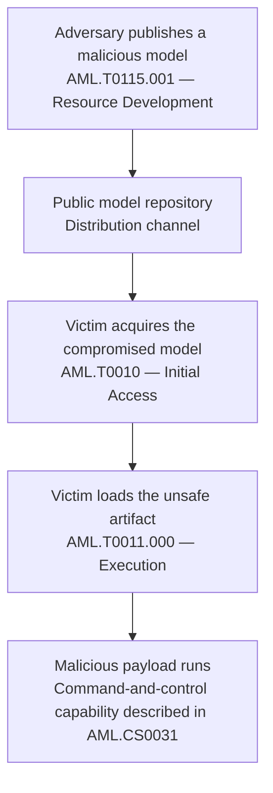

# Week 1 — Cyber Threat Intelligence Fundamentals

## Detection and Threat Intelligence Analysis of AI Supply Chain Threats Using MITRE ATLAS

**Course:** Introduction to Threat Hunting  
**Academic year:** 2026–2027  
**Project focus:** Malicious and poisoned AI models distributed through public repositories  
**Weekly increment:** Terminology, threat classification, and source-based case analysis  
**Source snapshot:** MITRE ATLAS data release `2026.09`  
**Sources accessed:** 24 September 2026

---

## 1. Objective and research question

The objective of this increment is to establish the vocabulary and threat classification for the project before collecting indicators or developing detection methods.

**Research question:** How can MITRE ATLAS describe and classify threats introduced through externally acquired AI models and related artifacts?

The primary focus is malicious or poisoned model artifacts. Datasets and AI software dependencies are included for comparison, not as separate full-scale investigations.

This report delivers a glossary of CTI-related terminology, a classification of threats and their origins, a distinction between threat sources and intelligence sources, and an analysis of relevant ATLAS cases.

**Scope boundary:** This is a documentation-based increment. No malicious models were downloaded or executed, no infrastructure was scanned, and no detection system was implemented or evaluated. “Detection” in the project title describes a later project objective, not a completed Week 1 result.

## 2. Source basis and analytical approach

MITRE ATLAS is a public knowledge base of adversary tactics, techniques, and procedures involving AI systems. Its official data repository distributes tactics, techniques, mitigations, case studies, and their relationships. [1][R1]

All technical descriptions in this report are based on the official ATLAS records in release `2026.09`. The release is identified explicitly so that later changes to technique names or mappings do not silently change the basis of the report. [2][R2]

The analysis uses three kinds of ATLAS information:

| Intelligence source within ATLAS | Information used in this increment | Limitation |
|---|---|---|
| Tactic and technique records | Adversary objectives, methods, affected components, and distribution channels | A technique description alone does not establish that a particular organization was attacked. |
| Case-study records and procedure mappings | Described events or demonstrations, targets, reported actors, and mapped behavior | Findings are limited to what the selected case actually reports. |
| Official release data | Record identifiers, names, case types, and relationships | The snapshot supports reproducibility; it does not establish current conditions at a repository. |

These are the report's rules for interpreting the records, rather than additional MITRE classifications. The underlying ATLAS data distinguishes these record types and their relationships. [1][R1] [2][R2]

Third-party organizations appear below only where ATLAS identifies them in a case study. Their original websites and reports are **not** used as additional sources. The project scope, comparisons, diagram, and presentation plan are the report's own organization of the cited material.

## 3. Glossary of key CTI and project terms

The explanations below are concise paraphrases or contextual explanations of the cited ATLAS records, not quotations from a formal MITRE glossary. **CTI** and **procedure** are explicitly defined as working terms for this project because the selected records do not provide standalone definitions of them.

| Term | Meaning used in this report | ATLAS basis |
|---|---|---|
| **Cyber Threat Intelligence (CTI)** | **Project working definition:** analysis of documented adversary behavior to explain a threat, its entry route, its affected components, and the evidence supporting the assessment. Here, the evidence consists of ATLAS records. | [1][R1], [12][R12], [13][R13] |
| **MITRE ATLAS** | Adversarial Threat Landscape for AI Systems; the knowledge base used to organize this report's analysis. | [1][R1] |
| **Tactic** | The adversary objective represented by a category such as Resource Development or Initial Access. | [3][R3] |
| **Technique** | A described adversary method associated with an objective; for example, AI Supply Chain Compromise. | [1][R1], [4][R4] |
| **Sub-technique** | A more specific form of a parent technique. For example, Model (`AML.T0010.003`) specializes AI Supply Chain Compromise (`AML.T0010`). | [1][R1], [7][R7] |
| **Procedure** | **Project working definition:** the case-specific description of how a technique was carried out, such as uploading a malicious model to a repository. | [13][R13] |
| **TTPs** | Tactics, techniques, and procedures: the objectives, methods, and case-specific behavior examined together in this report. | [1][R1], [3][R3], [13][R13] |
| **Threat actor / adversary** | The party performing the attack. An actor may remain unidentified: ATLAS records the actor in the main case as “Unknown.” | [12][R12] |
| **Resource Development** | Establishing resources that can support adversary operations, including artifacts, infrastructure, accounts, or capabilities. | [3][R3] |
| **Initial Access** | Obtaining an initial foothold in the target system through an entry route. | [3][R3] |
| **Execution** | Running adversary-controlled code on a local or remote system. | [3][R3] |
| **AI artifact** | An AI-related item involved in the analysis, such as a model, dataset, or agent tool. Model artifacts may also contain executable or behavior-shaping components. | [8][R8], [9][R9] |
| **AI Supply Chain Compromise** | Obtaining access through compromised AI supply-chain components, such as software, data, hardware, or models. | [4][R4] |
| **Poisoned AI model** | A distributed model containing manipulated components that produce malicious behavior or execute malicious code. The affected components can include weights, configuration, architecture, or serialized code. | [8][R8] |
| **Embedded malware** | Malicious code placed inside an AI model file; the model may still appear to operate normally. | [10][R10] |
| **Unsafe AI artifact** | An artifact that has harmful effects when loaded, interpreted, executed, or used for inference. Harm can involve host code execution or altered AI behavior. | [9][R9] |
| **Training Data Poisoning** | Manipulating training or fine-tuning data to influence the resulting model, including its errors, behavior, performance, or response to triggers. | [11][R11] |
| **Case-study type** | The classification attached to an ATLAS case. The selected examples include **Incident** and **Exercise**, which are kept distinct in this report. | [12][R12], [14][R14], [15][R15] |

## 4. Classification of threats and their sources

For this project, **threat source** means the adversary-controlled or compromised component and the channel through which it reaches the victim. This is different from the **intelligence source**, which is the ATLAS record used to study it.

The following categories are an analytical grouping of ATLAS techniques, not an additional official ATLAS taxonomy.

| Threat category | Compromised component and distribution source | Described effect | Relevant ATLAS records |
|---|---|---|---|
| **Malware-bearing model artifact — primary focus** | Malicious code inside a model distributed through a model registry, code repository, or another model distribution channel | Code executes when the unsafe artifact is processed; embedded malware can support further attacker activity. | Publish Poisoned AI Artifacts: Models (`AML.T0115.001`); Manipulate AI Model: Embed Malware (`AML.T0018.002`); User Execution: Unsafe AI Artifacts (`AML.T0011.000`). [8][R8] [9][R9] [10][R10] |
| **Behavior-manipulating model artifact — primary focus** | Modified prompt-construction logic or other behavior-shaping components bundled with a distributed model | Model outputs or agent behavior can be redirected without changing model weights. | Manipulate AI Model: Modify Prompt Construction Logic (`AML.T0018.003`); `AML.CS0064`. [10][R10] [15][R15] |
| **Poisoned dataset — comparison** | Manipulated samples, labels, annotations, or metadata distributed through dataset repositories or compromised data sources | Incorporation into training or fine-tuning can change the resulting model's behavior. | Publish Poisoned AI Artifacts: Datasets (`AML.T0115.000`); AI Supply Chain Compromise: Data (`AML.T0010.002`); Training Data Poisoning (`AML.T0020`). [6][R6] [8][R8] [11][R11] |
| **Malicious AI software dependency — comparison** | A compromised legitimate package or a malicious package introduced through a software dependency chain | The victim acquires malicious software while obtaining components for an AI environment. | AI Supply Chain Compromise: AI Software (`AML.T0010.001`); `AML.CS0015`. [5][R5] [14][R14] |

### Important distinctions

**Publishing and consuming are different stages.** Publishing a poisoned model is recorded under Resource Development; the victim's acquisition of the malicious artifact is represented by supply-chain compromise under Initial Access. Loading the unsafe artifact is a further stage. These distinctions are present in the main case's procedure mappings. [13][R13]

**Model-file malware and training-data poisoning are not interchangeable.** The former embeds malicious code in an artifact; the latter changes the data used to train or fine-tune a model. They require separate descriptions even when both belong to the wider project topic. [10][R10] [11][R11]

**A distribution platform is not automatically the attacker.** In the main case, ATLAS separately identifies the actor as Unknown, the target as Hugging Face users, and the reporter as ReversingLabs. This report preserves those roles. [12][R12]

## 5. Main case study: Malicious Models on Hugging Face

**ATLAS ID:** `AML.CS0031`  
**ATLAS case type:** Incident  
**Recorded actor:** Unknown  
**Recorded target:** Hugging Face users  
**Recorded reporter:** ReversingLabs. [12][R12]

### What ATLAS reports

ATLAS describes models containing embedded malware on the Hugging Face repository. Researchers found that loading the models executed reverse-shell payloads, providing command-and-control capability. The files were corrupted so that the malicious payload could run before deserialization ultimately failed. The scanning behavior described in the case did not identify those models as malicious. [12][R12]

ATLAS also records that the models were removed and the scanner was changed to address the particular attack. The case therefore documents a historical finding; it is not evidence that the same files or scanner behavior remain present today. [12][R12]

### Mapping the behavior

The following is a **selected subset** of the procedure mappings in the ATLAS case, not the complete attack sequence. [13][R13]

| Case behavior | ATLAS technique or sub-technique | Tactic in the case |
|---|---|---|
| The adversary uploads a malicious model to the repository. | `AML.T0115.001` — Publish Poisoned AI Artifacts: Models | Resource Development |
| A user acquires the compromised model through the repository. | `AML.T0010` — AI Supply Chain Compromise | Initial Access |
| Loading the model causes its malicious payload to execute. | `AML.T0011.000` — User Execution: Unsafe AI Artifacts | Execution |

**Project interpretation:** This case supports examining both the model's distribution route and what happens when the artifact is processed. It does not justify treating every model on a public repository as malicious. [12][R12] [13][R13]

## 6. Comparison cases

### 6.1 Compromised PyTorch Dependency Chain — `AML.CS0015`

ATLAS classifies this case as an **Incident**. Between 25 and 30 December 2022, affected Linux installations of PyTorch-nightly received a malicious package from PyPI that shared a dependency's name. ATLAS describes the mechanism as dependency confusion and records exposure of sensitive information. The actor is recorded as Unknown. [14][R14]

**Relevance:** This is an AI software dependency example, not evidence of manipulated model weights. It supports keeping software-chain compromise distinct from malicious model artifacts. [5][R5] [14][R14]

### 6.2 Poisoned GGUF Templates: Inference-Time Supply Chain Attack — `AML.CS0064`

ATLAS classifies this case as an **Exercise** by Pillar Security and Fujitsu Research of Europe. The described demonstration modified chat templates bundled with model artifacts, producing an inference-time backdoor without changing model weights. Triggered template logic could influence model responses and agent behavior. [15][R15]

**Relevance:** This comparison shows why the project's model-artifact scope includes bundled behavior-shaping components, not only weights or embedded host malware. It is reported here as a research exercise, not as an independently confirmed criminal campaign. [10][R10] [15][R15]

## 7. Conceptual attack-path diagram

The diagram below summarizes the selected malicious-model path from `AML.CS0031`. It is a report-created schematic, not a screenshot or a complete reproduction of the ATLAS case. Preparation and scanner-evasion steps are omitted. [13][R13]



**Text equivalent:** malicious model publication → repository distribution → victim acquisition → unsafe artifact loading → malicious payload execution.

## 8. Findings and limitations

### Findings

The selected records support three distinctions relevant to the research question: **which component is compromised**, **how it reaches the victim**, and **what happens when it is used**. The model, dataset, and software categories in Section 4 organize those distinctions without treating them as identical attacks. [4][R4] [5][R5] [6][R6] [7][R7]

The comparison between `AML.CS0031` and `AML.CS0064` also supports distinguishing embedded host malware from malicious behavior introduced through model-bundled templates. Both are relevant to the project, but their mechanisms differ. [12][R12] [15][R15]

### Evidence boundaries

This increment does not estimate attack prevalence, identify an unknown attacker, or assign numerical likelihood or severity scores. It does not claim that a detection rule has been tested.

No concrete indicators of compromise are supplied. For example, the main case's procedure mentions a hardcoded callback IP address but does not provide its value in that description; this report does not invent one. [13][R13]

The report is limited to the selected ATLAS descriptions and mappings. It is a foundation for later collection and detection work, not an independently reproduced investigation.

## 9. Week 1 deliverables

| Deliverable | Location in this README |
|---|---|
| Project objective and bounded scope | Section 1 |
| Source basis and interpretation rules | Section 2 |
| Glossary of key CTI and project terms | Section 3 |
| Classification of threat types and their sources | Section 4 |
| Application to documented ATLAS cases | Sections 5–6 |
| Visual explanation of the selected attack path | Section 7 |
| Findings and evidence limitations | Section 8 |
| Defense outline and repository recording instructions | Sections 10–11 |
| Traceable official sources | Section 12 |

**Increment conclusion:** Week 1 establishes the terminology, threat categories, and case-based justification for investigating malicious AI artifacts. The next increment can build a collection plan around these categories without presenting planned collection as completed work.

## 10. Group defense outline — 7 minutes 30 seconds

This is a proposed presentation plan, not a record of a completed defense.

| Time | What to explain |
|---|---|
| 0:00–0:45 | State the project topic, research question, and Week 1 boundary. |
| 0:45–1:45 | Explain tactic, technique, and procedure using the main case. |
| 1:45–3:00 | Compare model artifacts, datasets, and software dependencies; distinguish threat sources from intelligence sources. |
| 3:00–4:30 | Present the Hugging Face case and explain the three selected ATLAS mappings. |
| 4:30–5:15 | Contrast the PyTorch incident with the GGUF research exercise. |
| 5:15–6:15 | Walk through the diagram and identify the victim action at each stage. |
| 6:15–7:00 | Explain the main findings and the limits of the available evidence. |
| 7:00–7:30 | Show the Week 1 repository increment and summarize the next collection objective. |

## 11. Repository transparency

**Intended repository path:** `week1/README.md`.

After reviewing the document, run the following from the existing project repository:

```bash
# Review and stage the actual Week 1 document.
git status
git add week1/README.md
git diff --cached

# Record and publish the reviewed increment.
git commit -m "docs(week1): add ATLAS glossary and threat classification"
git push

# Display the real history for this increment.
git log --oneline -- week1/README.md
```

These commands are submission instructions; their inclusion does not mean that a commit or upload has already occurred. Record subsequent substantive corrections in further commits when those edits are made.

**Preparation note:** AI assistance was used to draft and organize this document. Group members must review the cited records, understand the analysis, and follow the instructor's rules on permitted assistance before submitting or defending the report.

## 12. References — MITRE ATLAS only

The technical source of record is the official MITRE ATLAS dataset pinned to release `v2026.09`. Links below point to the official repository and the relevant records or relationship sections. The [MITRE ATLAS website][ATLAS] provides the corresponding knowledge-base interface.

1. **MITRE ATLAS Data — repository overview and data model.** [Official repository][R1].
2. **MITRE ATLAS release `2026.09`.** [Version-pinned dataset][R2].
3. **Resource Development, Initial Access, and Execution** — `AML.TA0003`, `AML.TA0004`, `AML.TA0005`. [Tactic records][R3].
4. **AI Supply Chain Compromise** — `AML.T0010`. [Technique record][R4].
5. **AI Supply Chain Compromise: AI Software** — `AML.T0010.001`. [Sub-technique record][R5].
6. **AI Supply Chain Compromise: Data** — `AML.T0010.002`. [Sub-technique record][R6].
7. **AI Supply Chain Compromise: Model** — `AML.T0010.003`. [Sub-technique record][R7].
8. **Publish Poisoned AI Artifacts**, including **Datasets** and **Models** — `AML.T0115`, `AML.T0115.000`, `AML.T0115.001`. [Technique and sub-technique records][R8].
9. **User Execution: Unsafe AI Artifacts** — `AML.T0011.000`. [Sub-technique record][R9].
10. **Manipulate AI Model: Embed Malware** and **Modify Prompt Construction Logic** — `AML.T0018.002`, `AML.T0018.003`. [Sub-technique records][R10].
11. **Training Data Poisoning** — `AML.T0020`. [Technique record][R11].
12. **Malicious Models on Hugging Face** — `AML.CS0031`. [Case-study description and metadata][R12].
13. **Malicious Models on Hugging Face** — `AML.CS0031`. [Case-specific procedure mappings][R13].
14. **Compromised PyTorch Dependency Chain** — `AML.CS0015`. [Case-study record][R14].
15. **Poisoned GGUF Templates: Inference-Time Supply Chain Attack** — `AML.CS0064`. [Case-study record][R15].

[ATLAS]: https://atlas.mitre.org/
[R1]: https://github.com/mitre-atlas/atlas-data#readme
[R2]: https://raw.githubusercontent.com/mitre-atlas/atlas-data/v2026.09/dist/v6/ATLAS-2026.09.yaml
[R3]: https://github.com/mitre-atlas/atlas-data/blob/v2026.09/dist/v6/ATLAS-2026.09.yaml#L100-L162
[R4]: https://github.com/mitre-atlas/atlas-data/blob/v2026.09/dist/v6/ATLAS-2026.09.yaml#L1109-L1127
[R5]: https://github.com/mitre-atlas/atlas-data/blob/v2026.09/dist/v6/ATLAS-2026.09.yaml#L1145-L1190
[R6]: https://github.com/mitre-atlas/atlas-data/blob/v2026.09/dist/v6/ATLAS-2026.09.yaml#L1192-L1219
[R7]: https://github.com/mitre-atlas/atlas-data/blob/v2026.09/dist/v6/ATLAS-2026.09.yaml#L1221-L1242
[R8]: https://github.com/mitre-atlas/atlas-data/blob/v2026.09/dist/v6/ATLAS-2026.09.yaml#L4937-L5001
[R9]: https://github.com/mitre-atlas/atlas-data/blob/v2026.09/dist/v6/ATLAS-2026.09.yaml#L1337-L1369
[R10]: https://github.com/mitre-atlas/atlas-data/blob/v2026.09/dist/v6/ATLAS-2026.09.yaml#L1846-L1885
[R11]: https://github.com/mitre-atlas/atlas-data/blob/v2026.09/dist/v6/ATLAS-2026.09.yaml#L1887-L1910
[R12]: https://github.com/mitre-atlas/atlas-data/blob/v2026.09/dist/v6/ATLAS-2026.09.yaml#L7808-L7837
[R13]: https://github.com/mitre-atlas/atlas-data/blob/v2026.09/dist/v6/ATLAS-2026.09.yaml#L11761-L11822
[R14]: https://github.com/mitre-atlas/atlas-data/blob/v2026.09/dist/v6/ATLAS-2026.09.yaml#L7208-L7236
[R15]: https://github.com/mitre-atlas/atlas-data/blob/v2026.09/dist/v6/ATLAS-2026.09.yaml#L8941-L8977
