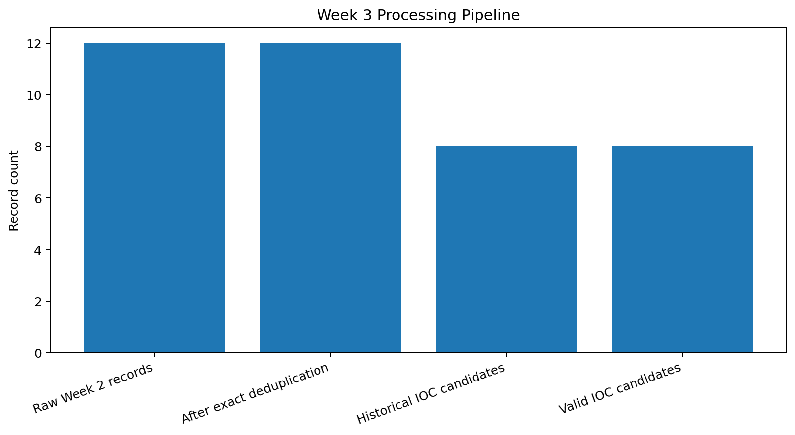
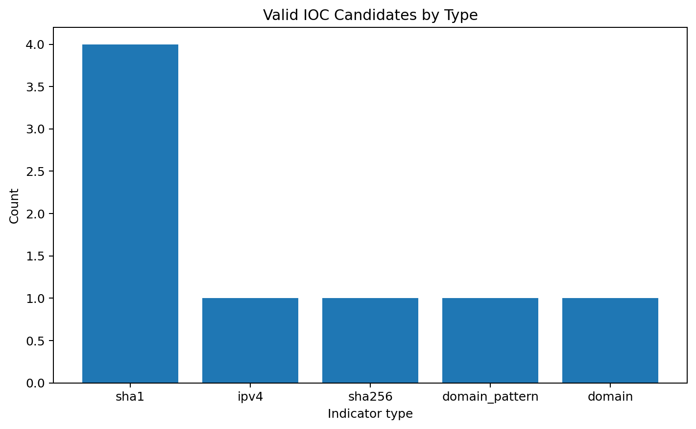
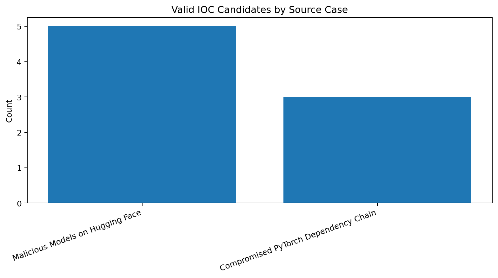

# Week 3 — Data Processing and Exploitation

## AI Supply Chain Threat Intelligence

**Course:** Introduction to Threat Hunting  
**Project:** Detection and Threat Intelligence Analysis of AI Supply Chain Threats Using MITRE ATLAS  
**Week 3 focus:** Filtering, normalization, validation, enrichment, and correlation of the threat-intelligence data collected during Week 2  
**Processing environment:** Google Colab, Python, pandas, Matplotlib  
**Date:** 24 September 2026

---

## 1. Objective

The goal of Week 3 was to transform the public-source threat-intelligence observations collected during Week 2 into a cleaner and more structured CTI dataset.

Week 2 produced raw observables, case metadata, and MITRE ATLAS mappings. Week 3 processes those records so that they are easier to validate, compare, correlate, and reuse in later threat-hunting tasks.

The workflow implemented in Google Colab was:

```text
Week 2 raw CTI data
        ↓
Cleaning
        ↓
Exact deduplication
        ↓
Type-aware normalization
        ↓
Syntax validation
        ↓
IOC / context filtering
        ↓
Case-level enrichment
        ↓
MITRE ATLAS correlation
        ↓
Structured CSV / JSON output + charts
```

The executed notebook is available here:

[`week3_data_processing.ipynb`](week3_data_processing.(1)ipynb)

---

## 2. Input data

The notebook uses three datasets created during Week 2:

| File | Purpose |
|---|---|
| `observables.csv` | Raw observables, historical IOC candidates, and contextual records |
| `cases.csv` | Case-level context such as ATLAS case ID, title, component, and distribution channel |
| `atlas_mappings.csv` | Selected mappings between the investigated cases and MITRE ATLAS techniques |

These inputs come from the Week 2 data-collection increment and are not newly invented for Week 3.

Primary Week 3 processing is performed on `observables.csv`. The other two files are used for enrichment and correlation.

---

## 3. Processing methodology

### 3.1 Cleaning

Leading and trailing whitespace was removed from all text fields before further processing.

### 3.2 Exact deduplication

Records were checked for exact duplicates using:

```text
case_id + type + value_as_reported
```

This prevents the same observable from being counted multiple times inside the same case.

### 3.3 Type-aware normalization

Normalization rules were applied according to the observable type.

Examples from the dataset:

| Original value | Normalized value | Action |
|---|---|---|
| `*.h4ck[.]cfd` | `*.h4ck.cfd` | Refanged dot notation |
| `wheezy[.]io` | `wheezy.io` | Refanged dot notation |

Hashes were normalized to lowercase where necessary. Repository identifiers, package names, and file paths were retained as contextual values rather than being incorrectly converted into network or file IOCs.

### 3.4 Syntax validation

The notebook validates supported IOC types:

- SHA-1
- SHA-256
- IPv4
- domain
- domain pattern

Validation checks whether a value has a syntactically valid format. It does **not** prove that an indicator is currently malicious.

### 3.5 IOC/context filtering

The source dataset contains both indicators and contextual information.

Records classified as historical IOC candidates were separated from contextual records such as:

- repository identifiers;
- package names;
- file paths.

This prevents contextual values from being treated as malicious indicators without evidence.

### 3.6 Enrichment

Validated indicators were enriched with case metadata from `cases.csv`, including:

- MITRE ATLAS case ID;
- case title;
- affected component;
- distribution channel;
- reported mechanism;
- evidence boundary.

### 3.7 MITRE ATLAS correlation

Indicators were correlated with the ATLAS techniques mapped to their source case.

This is a **case-based correlation**. It means that an observable inherits the selected ATLAS context of the case in which it was reported. It does not mean that a single hash, IP address, or domain independently proves every technique mapped to that case.

---

## 4. Processing results

The completed Colab run produced the following results:

| Metric | Result |
|---|---:|
| Raw Week 2 records | **12** |
| Exact duplicates removed | **0** |
| Records after deduplication | **12** |
| Records changed during normalization | **2** |
| Historical IOC candidates | **8** |
| Valid IOC candidates | **8** |
| Invalid IOC candidates | **0** |
| Context-only records | **4** |

All eight historical IOC candidates passed the implemented syntax-validation rules.

The absence of invalid values or duplicates does not mean that the processing stage was unnecessary. It demonstrates that the Week 2 dataset was internally consistent under the validation rules applied in this notebook.

---

## 5. Processing pipeline visualization



**Figure 1.** Number of records at the main stages of the Week 3 processing pipeline.

The raw dataset contained 12 records. Eight records were identified as historical IOC candidates, while four were preserved as contextual intelligence.

---

## 6. Valid IOC candidates by type



**Figure 2.** Distribution of syntactically valid historical IOC candidates by type.

The final IOC set contains:

| Indicator type | Count |
|---|---:|
| SHA-1 | **4** |
| IPv4 | **1** |
| SHA-256 | **1** |
| Domain pattern | **1** |
| Domain | **1** |
| **Total** | **8** |

The distribution is dominated by SHA-1 hashes from the malicious-model case, while the PyTorch dependency-chain case contributes a SHA-256 hash and domain-related indicators.

---

## 7. Valid IOC candidates by source case



**Figure 3.** Distribution of the final IOC candidates across the cases that supplied concrete observables.

| MITRE ATLAS case | Valid IOC candidates |
|---|---:|
| `AML.CS0031` — Malicious Models on Hugging Face | **5** |
| `AML.CS0015` — Compromised PyTorch Dependency Chain | **3** |

The first case contributes four SHA-1 hashes and one reported IPv4 callback address. The second contributes one SHA-256 hash, one domain pattern, and one domain.

---

## 8. Enrichment and ATLAS correlation

### `AML.CS0031` — Malicious Models on Hugging Face

The selected Week 2 ATLAS mappings for this case include:

- `AML.T0018.002` — Manipulate AI Model: Embed Malware
- `AML.T0115.001` — Publish Poisoned AI Artifacts: Models
- `AML.T0010` — AI Supply Chain Compromise
- `AML.T0011.000` — User Execution: Unsafe AI Artifacts

The processed dataset contains five valid historical IOC candidates associated with this case.

### `AML.CS0015` — Compromised PyTorch Dependency Chain

The selected mapping is:

- `AML.T0010.001` — AI Supply Chain Compromise: AI Software

The processed dataset contains three valid historical IOC candidates associated with this case.

The complete case-enriched and ATLAS-correlated data is stored in:

[`data/enriched_indicators.csv`](data/enriched_indicators.csv)

---

## 9. Generated outputs

The Colab notebook exported the following files:

### Data

| File | Description |
|---|---|
| [`data/cleaned_observables.csv`](data/cleaned_observables.csv) | Full cleaned observable dataset, including IOC and contextual records |
| [`data/normalized_iocs.csv`](data/normalized_iocs.csv) | Final normalized and validated IOC candidates |
| [`data/enriched_indicators.csv`](data/enriched_indicators.csv) | Valid indicators enriched with case metadata and ATLAS context |
| [`data/indicators.json`](data/indicators.json) | Machine-readable JSON representation of the enriched indicators |
| [`data/processing_summary.csv`](data/processing_summary.csv) | Record counts from the main processing stages |

### Evidence

[`evidence/processing_summary.txt`](evidence/processing_summary.txt) contains a text summary generated directly by the notebook.

### Visualizations

- [`images/before_after_processing.png`](images/before_after_processing.png)
- [`images/indicator_types.png`](images/indicator_types.png)
- [`images/indicators_by_case.png`](images/indicators_by_case.png)

---

## 10. Quality assurance

The notebook performs automated quality checks after generating the final dataset.

All checks passed:

| Quality check | Result |
|---|---|
| No duplicate final IOC rows | **PASS** |
| All final IOC candidates passed syntax validation | **PASS** |
| Every final IOC has a source URL | **PASS** |
| Every final IOC has case enrichment | **PASS** |
| Every final IOC has at least one correlated ATLAS technique | **PASS** |

These checks make the processing workflow reproducible and help detect mistakes before the data is reused in later project stages.

---

## 11. Evidence boundaries and limitations

Several boundaries are intentionally preserved.

1. **No live scanning was performed.**  
   The notebook did not connect to, scan, query, or reputation-check any reported IP address, domain, repository, or file hash.

2. **The indicators are historical.**  
   Their inclusion means that the cited Week 2 source reported them in the investigated case. It does not mean that they are currently malicious or active.

3. **Syntax validation is not reputation validation.**  
   A syntactically valid IP address, domain, or hash is not automatically a confirmed malicious indicator.

4. **Context records are kept separate.**  
   Repository names, package names, and file paths are useful intelligence context but are not automatically treated as IOCs.

5. **ATLAS correlation is case-based.**  
   Technique mappings describe the source case and should not be interpreted as proof that each individual observable independently demonstrates every mapped technique.

6. **No MISP deployment was performed in this implementation.**  
   Google Colab was used as the processing environment for filtering, normalization, validation, enrichment, correlation, export, and visualization. The resulting structured data can be used later as input to a dedicated CTI platform.

---

## 12. Reproducibility

To reproduce the processing:

1. Open [`week3_data_processing.ipynb`](week3_data_processing.ipynb) in Google Colab.
2. Upload the Week 2 files:
   - `observables.csv`
   - `cases.csv`
   - `atlas_mappings.csv`
3. Run the notebook from top to bottom.
4. Verify that the quality-check section reports all checks as `True`.
5. Download the generated `week3_colab_results.zip`.

The notebook automatically creates the processed CSV/JSON files, evidence summary, and three figures included in this repository.

---

## 13. Repository structure

```text
week3/
├── README.md
├── week3_data_processing.ipynb
│
├── data/
│   ├── cleaned_observables.csv
│   ├── enriched_indicators.csv
│   ├── indicators.json
│   ├── normalized_iocs.csv
│   └── processing_summary.csv
│
├── evidence/
│   └── processing_summary.txt
│
└── images/
    ├── before_after_processing.png
    ├── indicator_types.png
    └── indicators_by_case.png
```

---

## 14. Week 3 conclusion

Week 3 converted the raw public-source intelligence collected during Week 2 into a structured CTI dataset.

The main result was not the discovery of new threats, but the creation of a reproducible processing pipeline that:

- cleans raw observations;
- removes duplicates;
- normalizes indicator values;
- validates IOC syntax;
- separates indicators from contextual intelligence;
- enriches indicators with case information;
- correlates the data with selected MITRE ATLAS techniques;
- exports reusable CSV and JSON datasets;
- produces visual evidence of the processing results.

The final dataset contains **8 validated historical IOC candidates** and **4 contextual records** derived from **12 Week 2 observations**.

This processed dataset provides a cleaner foundation for later threat-hunting and detection-oriented project increments.

---

## 15. Sources

The underlying threat information and observables were collected during Week 2 from real public sources.

1. **MITRE ATLAS** — Adversarial Threat Landscape for AI Systems  
   https://atlas.mitre.org/

2. **MITRE ATLAS Data, release 2026.09**  
   https://github.com/mitre-atlas/atlas-data

3. **ReversingLabs — Malicious Models on Hugging Face**  
   https://www.reversinglabs.com/blog/rl-identifies-malware-ml-model-hosted-on-hugging-face

4. **PyTorch — Compromised PyTorch-nightly dependency chain**  
   https://pytorch.org/blog/compromised-nightly-dependency/

Additional case research and source documentation remain available in the Week 2 increment of this repository.

---

## 16. Short defense summary

For a short classroom demonstration, the Week 3 increment can be explained as:

> During Week 2 we collected public threat-intelligence observations about AI supply-chain incidents. During Week 3 we processed these data in Google Colab. We cleaned and normalized the records, validated IOC syntax, separated IOC candidates from contextual information, enriched the indicators with case metadata, and correlated them with MITRE ATLAS techniques. From 12 raw observations, 8 were retained as valid historical IOC candidates and 4 as contextual records. The workflow produced reproducible CSV and JSON datasets, three visualizations, and automated quality checks.
