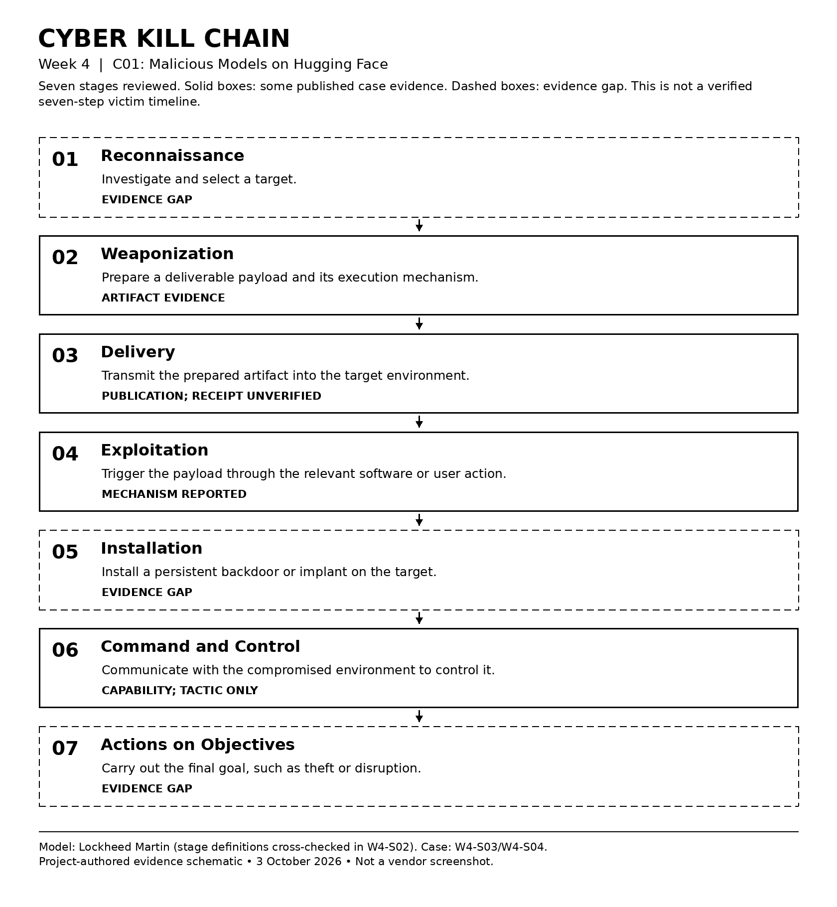
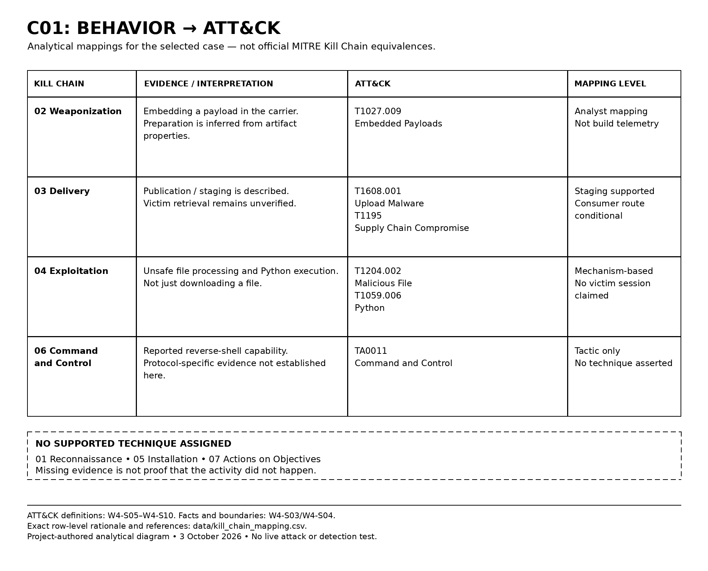

# Week 4 — The Cyber Kill Chain

## AI Supply Chain Threat Intelligence

**Project:** Detection and Threat Intelligence Analysis of AI Supply Chain Threats Using MITRE ATLAS  
**Course:** Introduction to Threat Hunting · Academic year 2026–2027  
**Increment:** Case reconstruction, Cyber Kill Chain analysis, and MITRE ATT&CK mapping  
**Case:** C01 · `AML.CS0031` · *Malicious Models on Hugging Face*  
**Analysis date:** 3 October 2026

> **Result:** All seven Kill Chain stages were assessed. Five distinct ATT&CK technique/sub-technique IDs were selected as analytical mappings across three stages; the C2 stage is mapped at tactic level only. Reconnaissance, persistent installation, and completed objectives remain evidence gaps. These are analysis results, not seven confirmed attacker actions.

## 1. Objective and continuity

**Research question:** How far can the published C01 evidence be reconstructed using the Cyber Kill Chain, and which Enterprise ATT&CK behaviors can be supported without inventing missing activity?

Week 1 defined the threat categories. Week 2 collected cases, sources, observables, and ATLAS relationships. Week 3 processed those records. Week 4 now adds **attack-stage context and Enterprise ATT&CK mappings** to one existing case, rather than collecting another unrelated list of indicators.

| Week 4 task from the syllabus | Deliverable |
|---|---|
| Analyze a real-world cyberattack using the Kill Chain | C01 case analysis and seven-stage assessment in Sections 3–5 |
| Map each stage to corresponding ATT&CK TTPs | Row-by-row assessment, selected mappings, and justified non-assignments in Sections 5–6 and the CSV |
| Document and defend the weekly increment | Local diagrams, evidence register, and 7-minute-30-second defense outline |

**Case-selection boundary.** ATLAS classifies C01 as an **Incident**, with the actor recorded as **Unknown**. The primary researchers also discuss possible proof-of-concept intent. We therefore analyze a documented public malicious-artifact finding, **not a confirmed campaign with a reconstructed victim timeline**. [W4-S03][W4-S03] [W4-S04][W4-S04]

## 2. Framework and interpretation rules

The Lockheed Martin model provides seven stages: **Reconnaissance → Weaponization → Delivery → Exploitation → Installation → Command and Control → Actions on Objectives**. Figure 1 gives their short meanings. The stage definitions were cross-checked against the Hutchins et al. definitions reproduced in the research paper's *Kill chains* section; direct access to the original Lockheed Martin PDF was unavailable. The exact access boundary is recorded in [sources.md](evidence/sources.md). [W4-S01][W4-S01] [W4-S02][W4-S02]

For this project, the two frameworks answer different questions: **Kill Chain organizes the attack path; ATT&CK names specific behaviors and their objectives.** Assigning an ATT&CK technique to a Kill Chain row is our analysis, not an official one-to-one conversion published by MITRE or Lockheed Martin.

Three interpretation rules apply throughout:

- **Reported evidence** means a source describes an artifact, procedure, or researcher finding. It does not mean our group observed an infected host.
- **Analytical mapping** means we compared that evidence with an official ATT&CK definition and recorded why it fits, including conditional steps.
- **Not evidenced** means the reviewed sources do not establish the stage. It does not mean the stage was proven absent.

All seven stages receive an assessment. Where evidence cannot support a technique, the technique field is intentionally empty instead of being filled with an imagined attacker action.

## 3. Case evidence and an important loading distinction

The ATLAS record describes malicious model artifacts on Hugging Face, payload execution before a subsequent deserialization failure, and later removal and scanner changes. These are historical source statements, not a present-day security assessment. [W4-S04][W4-S04]

The primary report adds an important detail: the two outer model archives used **7z rather than the default ZIP packaging**, preventing ordinary `torch.load()` loading. Its analysis concerns the **extracted Pickle content**, which contains Python reverse-shell logic. Separately, the researchers used their own benign file-writing samples to examine the scanner/loader discrepancy. Those test files are not evidence of attacker persistence. [W4-S03][W4-S03]

Consequently, the proposed path must distinguish **published archive → acquisition → handling/extraction → unsafe deserialization → possible execution**. We do not claim that visiting the repository, merely downloading the file, or default loading of the original archive automatically compromised a user.

## 4. Cyber Kill Chain evidence overview



*Figure 1. Project-authored schematic of the seven-stage model and C01 evidence coverage. The stage descriptions are paraphrased from the model; solid and dashed outlines represent this project's evidence assessment. This is neither a Lockheed Martin original figure nor a screenshot of a live investigation. Sources: W4-S02–W4-S04.*

## 5. Seven-stage assessment

The table is the readable summary. [`data/kill_chain_mapping.csv`](data/kill_chain_mapping.csv) contains the full rationale, source locators, related Week 2 IDs, and evidence needed for each row.

| Kill Chain stage | C01 interpretation and evidence boundary | ATT&CK assessment |
|---|---|---|
| **1. Reconnaissance** | No documented target-selection activity. | **Not assigned.** An unknown actor does not justify inventing reconnaissance. |
| **2. Weaponization** | Preparation is inferred from the reported artifact properties, not from an observed build session. | **T1027.009 — Embedded Payloads.** Analytical correspondence for payload concealment within the carrier. [W4-S04][W4-S04] [W4-S05][W4-S05] |
| **3. Delivery** | Publication is documented; a completed transfer into a specific victim environment is not. | **T1608.001 — Upload Malware** for staging; **T1195 — Supply Chain Compromise** for the broader, conditional consumer route. [W4-S04][W4-S04] [W4-S06][W4-S06] [W4-S07][W4-S07] |
| **4. Exploitation** | Unsafe processing is the execution condition; see the archive-versus-Pickle distinction above. | **T1204.002 — Malicious File** for the user-processing condition; **T1059.006 — Python** for the interpreter behavior. No victim session is asserted. [W4-S03][W4-S03] [W4-S08][W4-S08] [W4-S09][W4-S09] |
| **5. Installation** | No separate persistent implant or autostart mechanism is established. | **Not assigned.** Loading a file is not sufficient evidence of persistence. |
| **6. Command and Control** | The recorded payload describes a callback capability, not our own network observation. | **TA0011 — Command and Control**, **tactic only**. Protocol-level technique left unresolved. [W4-S04][W4-S04] [W4-S10][W4-S10] |
| **7. Actions on Objectives** | No completed theft, disruption, or other post-access outcome is established in the reviewed case. | **Not assigned.** Capability is not proof of achieved impact. |

The unassigned rows are bounded assessments of the selected source material, not assertions about everything that might have happened. See the `evidence_needed` column for what would be required to extend them.

## 6. Why these ATT&CK mappings were selected



*Figure 2. Project-authored analytical mapping diagram generated from the same assessment as the CSV. These are not vendor-published mappings or experimental measurements. Sources: W4-S03–W4-S10.*

**Weaponization is not an ATT&CK tactic.** T1027.009 names an embedding/concealment behavior; it does not describe every activity involved in producing a weaponized file. The inspected ATT&CK page lists its tactic as **Stealth**. The table retains that source label in the CSV, rather than changing it to match the Kill Chain stage. [W4-S05][W4-S05]

**Publication is staging, not proof of receipt.** T1608.001 explicitly includes payloads hosted on third-party repositories. T1195 is a broader supply-chain interpretation here, rather than proof that an existing legitimate vendor account was compromised. We do not silently narrow it to software-dependency compromise, which belongs to the separate PyTorch comparison case. [W4-S06][W4-S06] [W4-S07][W4-S07]

**Exploitation does not automatically mean a software vulnerability exploit.** In this reconstruction, it is the point at which unsafe file handling triggers code. T1204.002 and T1059.006 describe the relevant user action and interpreter. We do not add a CVE, phishing delivery, or a memory-corruption exploit that the evidence does not establish. [W4-S02][W4-S02] [W4-S08][W4-S08] [W4-S09][W4-S09]

**C2 is deliberately tactic-only.** A reverse-shell label and callback address do not, by themselves, justify a specific protocol mapping. For example, **T1095 — Non-Application Layer Protocol** requires protocol-level evidence. It was reviewed but is **not assigned** in this dataset. [W4-S10][W4-S10] [W4-S11][W4-S11]

## 7. Findings and limitations

**Finding:** the useful reconstruction is a partially evidenced supply-chain path, not a forced seven-stage success story. The analytical output contains seven assessed rows, five distinct technique/sub-technique IDs, and one tactic-only C2 mapping.

**Limitations:** this is a desk-based analysis. No malicious model was downloaded or executed, no reported address was contacted, and no victim logs were obtained. Historical findings, researcher demonstrations, and possible victim behavior are kept separate. The diagrams show the analysis; they are not attack captures. The access and version limitations are recorded rather than hidden.

**AI assistance disclosure:** generative AI assisted with source discovery, explanation, ATT&CK comparison, documentation, CSV assembly, and layout of the source-based diagrams. This report does not claim independent experiments or independent authorship of the cited research. Group members must review the sources and understand the mapping decisions before defending the work.


## 8. Files and GitHub submission

```text
week4/
├── README.md
├── data/
│   └── kill_chain_mapping.csv
├── images/
│   ├── kill_chain_diagram.png
│   └── attack_mapping.png
└── evidence/
    └── sources.md
```

Both figures are **local PNG files**. Upload the entire `week4` folder into the existing repository root; do not upload only this README or flatten its subfolders. No Colab run or additional package installation is needed to view the report.

Suggested commit message:

```text
docs(week4): add evidence-based kill chain and ATT&CK analysis
```

Make this commit when the files are actually reviewed and uploaded. Do not backdate it or present a suggested command as a completed submission. Later substantive corrections should have their own commits.

## 9. Sources

The full register, locators, version notes, local provenance, and image attribution are in **[`evidence/sources.md`](evidence/sources.md)**. Source IDs use a `W4-` prefix so they are not confused with the Week 2 source IDs.

[W4-S01]: https://www.lockheedmartin.com/en-us/capabilities/cyber/cyber-kill-chain.html
[W4-S02]: https://academic.oup.com/cybersecurity/article/3/3/185/2804698
[W4-S03]: https://www.reversinglabs.com/blog/rl-identifies-malware-ml-model-hosted-on-hugging-face
[W4-S04]: https://raw.githubusercontent.com/mitre-atlas/atlas-data/main/dist/ATLAS.yaml
[W4-S05]: https://attack.mitre.org/techniques/T1027/009/
[W4-S06]: https://attack.mitre.org/techniques/T1608/001/
[W4-S07]: https://attack.mitre.org/techniques/T1195/
[W4-S08]: https://attack.mitre.org/techniques/T1204/002/
[W4-S09]: https://attack.mitre.org/techniques/T1059/006/
[W4-S10]: https://attack.mitre.org/tactics/TA0011/
[W4-S11]: https://attack.mitre.org/techniques/T1095/

## AI Assistance Disclosure

Generative AI was used to assist with this Week 4 assignment.
The AI tool used was **ChatGPT powered by GPT-5.6 Sol**.

AI was used to:
- help find and summarize information from the selected sources;
- organize the Cyber Kill Chain and MITRE ATT&CK mappings;
- help structure and format the README;
- generate the project diagrams based on the collected evidence;
- help prepare the CSV mapping and supporting notes.

The final report was based on the cited real sources, including MITRE ATT&CK, MITRE ATLAS, ReversingLabs, and Cyber Kill Chain materials. AI was used as a research and formatting assistant, not as the source of factual evidence.
