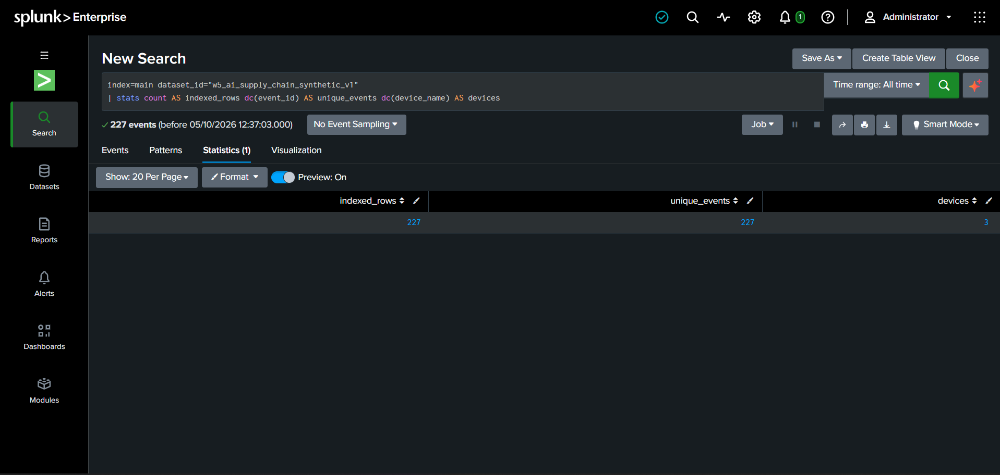
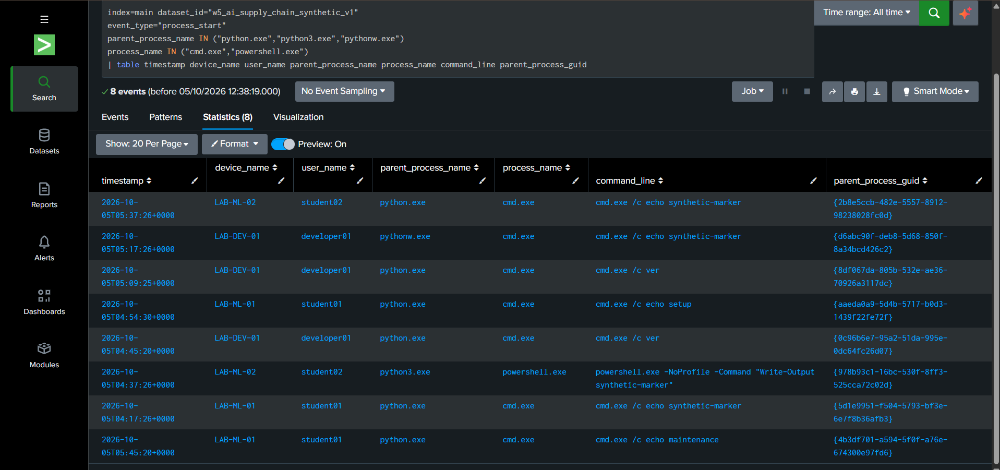
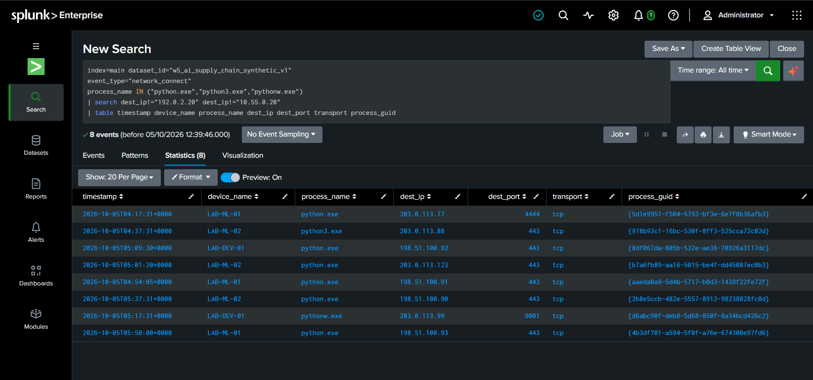
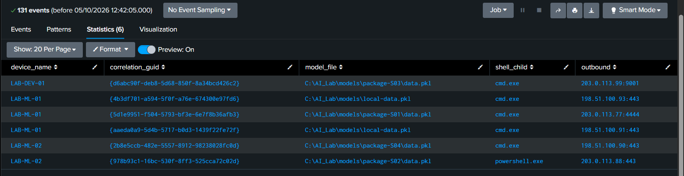
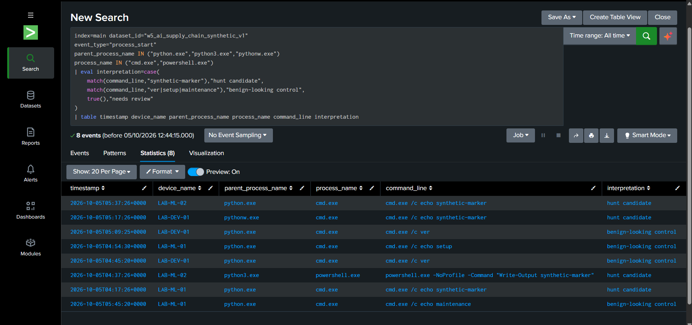

# Week 5 — Threat Hunting Concept

## Hypothesis-driven investigation of AI model-processing activity in Splunk

**Project:** Detection and Threat Intelligence Analysis of AI Supply Chain Threats Using MITRE ATLAS  
**Course:** Introduction to Threat Hunting · Astana IT University · 2026–2027  
**Practical execution:** 5 October 2026 · Splunk Enterprise, Search & Reporting  
**Dataset:** `w5_ai_supply_chain_synthetic_v1` · **synthetic teaching data**  
**Increment:** Hypothesis, executed searches, candidate review, and limitations

> **Observed results:** 227 indexed events, 227 unique event IDs, and 3 fictional devices. The searches returned 8 Python-spawned command-process events, 8 Python network leads, and 6 correlated process groups. These are **hunt candidates, not confirmed attacks**. The screenshots record actual Splunk query execution; the events being searched were generated for the exercise.

[Hypothesis](#2-hunting-hypothesis) · [Executed searches](#4-executed-searches-and-screenshot-evidence) · [Candidate review](#5-candidate-review-and-what-the-results-do-not-prove) · [Reproduce](#7-reproduce-the-documented-run) · [Sources](#9-sources-and-provenance)

## 1. Objective and connection to earlier weeks

Week 1 classified AI supply-chain threats. Week 2 collected public case evidence and technical observations. Week 3 processed those records. [Week 4](../week4/README.md) examined C01, *Malicious Models on Hugging Face*, and identified a follow-up question: could model processing be associated with an unexpected child process or network connection?

Week 5 turns that question into a **controlled hunting exercise**. We imported a purpose-built CSV into Splunk and executed searches for related application, process, and network records. The dataset does not reconstruct a victim timeline or replace the historical observations from Weeks 2–4.

| Week 5 activity | Evidence in this increment |
|---|---|
| Build a hypothesis-driven hunting scenario | The hypothesis, event requirements, and boundaries in Sections 2–3 |
| Execute hunt queries in Splunk or ELK | Five searches executed in Splunk, with screenshots and saved SPL in Section 4 |
| Interpret and document the findings | Candidate review, limitations, reproducibility instructions, and a defense outline |

The **intelligence-driven element** is the choice of behavior to investigate, informed by the earlier C01 analysis. The **hypothesis-driven element** is the explicit question tested against the teaching events. We do not assume an alert, a specific historical IP, or a filename proves compromise.

## 2. Hunting hypothesis

**Underlying idea:** unsafe processing of a model artifact may be associated with command execution and outbound activity. The source-derived context is the Week 4 analysis, not a new execution of a malicious model.

**H1 — hypothesis tested by the screenshot query:**

> In the imported dataset, a Python process associated with model-deserialization records, a child command process, and a network destination outside the two-address teaching inventory is a candidate for further investigation.

The query tests whether all three observations belong to the same **device and Python process instance**. It is a screening step, not a determination of malicious intent.

**Important distinction from the earlier plan.** The starter proposed a stricter sequence: deserialization → child shell → connection within **120 seconds**. The simplified query actually run in Splunk uses `stats values(...)` and **does not enforce event order or a 120-second window**. This README preserves the executed query and its six results. It does not present those results as verification of the stricter hypothesis. The effect of that limitation is visible in Section 5.

## 3. Dataset and environment

### Origin and scope

[`data/sample_logs.csv`](data/sample_logs.csv) is the unchanged synthetic CSV supplied for this exercise: **227 events, 24 fields, and 3 fictional Windows endpoints** (`LAB-ML-01`, `LAB-ML-02`, `LAB-DEV-01`). Its timestamps cover **5 October 2026, 04:00:00–05:50:20 UTC**. These are authored event times, not the date of the historical C01 incident.

Every record carries `synthetic=true`. The three logging families are `synthetic_application`, `synthetic_process`, and `synthetic_network`. This is a **custom schema**, not native Sysmon, Windows Event Log, an EDR export, or Splunk's Common Information Model. In a real deployment, a `model_deserialize` event would require appropriate application instrumentation; importing a CSV does not make Splunk observe Python internally.

All hosts, accounts, paths, GUIDs, destinations, ports, and event relationships are teaching assumptions. The command strings are harmless illustrative text, not reverse-shell payloads. No model was deserialized and no represented connection was made to generate these records. Paths such as `C:\AI_Lab\...` are fictional log values, not the student's Splunk installation directory.

### Relevant fields

| Field or group | Use in the hunt |
|---|---|
| `timestamp`, `event_id` | Original event time and unique teaching-record identifier |
| `dataset_id`, `synthetic`, `schema_version` | Dataset selection and provenance |
| `event_type`, `telemetry_source` | Distinguish model processing, process starts, and network records |
| `device_name`, `user_name` | Fictional endpoint and account; `device_name` is separate from Splunk's ingestion `host` |
| `process_guid`, `parent_process_guid` | Associate a Python process with its child command process |
| `process_name`, `parent_process_name`, `command_line` | Process identity, parent identity, and illustrative command text |
| `file_path`, `file_format` | Model/archive context for application events |
| `dest_ip`, `dest_port`, `transport` | Destination and transport values for synthetic network records |
| `action`, `status`, `bytes_sent` | Additional event context; none independently establishes malicious intent |

The remaining numeric process fields are `process_id` and `parent_process_id`. Correlation uses GUIDs rather than these numeric IDs. Empty cells are intentional where a field does not apply.

**Recorded event counts:** 51 process starts, 51 process ends, 61 network connections, 19 model-deserialization starts, 10 other model loads, 22 inference records, 5 artifact acquisitions, 4 extractions, 3 deserialization errors, and 1 outer-archive load error. Counts were checked against the bundled CSV during report preparation.

### Search environment and teaching inventory

The run used `index=main`, the dataset ID above, and **All time**. Splunk Enterprise is visible in the screenshots; its exact installed build was not captured and is not inferred from the documentation version.

The **executed** network searches exclude only `192.0.2.20` (fictional approved model registry) and `10.55.0.20` (fictional internal API). Other destinations are leads outside this small inventory, **not automatically malicious servers**. The apparent external addresses are drawn from documentation ranges, not live attacker infrastructure; RFC 5737 documents the three TEST-NET blocks. [R4]

## 4. Executed searches and screenshot evidence

All five searches are saved in [`queries/splunk_hunt_queries.spl`](queries/splunk_hunt_queries.spl). They match the submitted run; no time filter or new detection logic has been silently added. Run them **one at a time**. The screenshot files below are student-provided captures of Splunk, not generated interfaces. Open an image to inspect its full-resolution labels.

### Q01 — Confirm the indexed dataset

```spl
index=main dataset_id="w5_ai_supply_chain_synthetic_v1"
| stats count AS indexed_rows dc(event_id) AS unique_events dc(device_name) AS devices
```



*Figure 1. Actual Splunk dataset-check result. `indexed_rows=227`, `unique_events=227`, and `devices=3`.*

The indexed count agrees with the supplied CSV. Equal row and distinct-ID counts show no repeated `event_id` within this selected search result. They do not validate the realism of synthetic records. Splunk's `stats` performs the aggregation, with `dc` used here for distinct counts. [R1]

### Q02 — Find command processes spawned by Python

```spl
index=main dataset_id="w5_ai_supply_chain_synthetic_v1"
event_type="process_start"
parent_process_name IN ("python.exe","python3.exe","pythonw.exe")
process_name IN ("cmd.exe","powershell.exe")
| table timestamp device_name user_name parent_process_name process_name command_line parent_process_guid
```



*Figure 2. Eight matching process-start events. The table preserves the Python parent, child process, command line, and parent GUID.*

This is a broad behavioral lead: the displayed children are `cmd.exe` and `powershell.exe`. A helper command such as `cmd.exe /c ver` can match the same parent/child filter as the teaching marker. The result therefore does not establish eight attacks or eight reverse shells.

### Q03 — Find Python connections outside the selected inventory

```spl
index=main dataset_id="w5_ai_supply_chain_synthetic_v1"
event_type="network_connect"
process_name IN ("python.exe","python3.exe","pythonw.exe")
| search dest_ip!="192.0.2.20" dest_ip!="10.55.0.20"
| table timestamp device_name process_name dest_ip dest_port transport process_guid
```



*Figure 3. Eight matching network events. The screenshot shows destination, port, transport, and the originating process GUID.*

The search does not yet require a deserialization event or a child shell. Its eight events are a different set from Q02's eight process events. Port `443`, `4444`, or `9001` alone does not establish an application protocol, reverse shell, or compromise. The recorded `tcp` values are synthetic and do not resolve Week 4's historical C2 protocol-evidence gap.

### Q04 — Correlate the three observations by process instance

```spl
index=main dataset_id="w5_ai_supply_chain_synthetic_v1"
(event_type="model_deserialize" OR event_type="network_connect" OR event_type="process_start")
| eval shell_child=if(
    event_type="process_start"
    AND process_name IN ("cmd.exe","powershell.exe")
    AND parent_process_name IN ("python.exe","python3.exe","pythonw.exe"),
    process_name,
    null()
)
| eval outbound=if(
    event_type="network_connect"
    AND process_name IN ("python.exe","python3.exe","pythonw.exe")
    AND dest_ip!="192.0.2.20"
    AND dest_ip!="10.55.0.20",
    dest_ip.":".dest_port,
    null()
)
| eval model_file=if(event_type="model_deserialize",file_path,null())
| eval correlation_guid=if(isnotnull(shell_child),parent_process_guid,process_guid)
| stats values(model_file) AS model_file
        values(shell_child) AS shell_child
        values(outbound) AS outbound
        by device_name correlation_guid
| where isnotnull(model_file)
    AND isnotnull(shell_child)
    AND isnotnull(outbound)
```



*Figure 4. Actual Q04 result: **six rows in Statistics**. The `131 events` label counts the matching input events before aggregation, not 131 attacks. The screenshot captures the result table; the executed query is preserved above and in the SPL file.*

For a child command process, `correlation_guid` uses **the Python parent's GUID**. For the Python application and network records, it uses **the process's own GUID**. Grouping by that key together with `device_name` places related observations in the same row.

`values(...)` collects distinct field values within a group; the final `where` retains groups containing a model path, a shell child, and an outbound destination. This is **co-occurrence correlation**, not chronological reconstruction. Splunk documents `values` as a distinct-value aggregation ordered lexicographically, not a time-sequence test. [R1], [R2]

### Q05 — Illustrate the limits of command-text labels

```spl
index=main dataset_id="w5_ai_supply_chain_synthetic_v1"
event_type="process_start"
parent_process_name IN ("python.exe","python3.exe","pythonw.exe")
process_name IN ("cmd.exe","powershell.exe")
| eval interpretation=case(
    match(command_line,"synthetic-marker"),"hunt candidate",
    match(command_line,"ver|setup|maintenance"),"benign-looking control",
    true(),"needs review"
)
| table timestamp device_name parent_process_name process_name command_line interpretation
```



*Figure 5. Eight annotated rows: four labelled `hunt candidate` and four labelled `benign-looking control` by the query.*

**These labels are assigned by our `eval`, not by Splunk's malware analysis or an independent ground-truth check.** `match` searches the command string for the supplied regular expression. [R3] `synthetic-marker` is a teaching marker, not a threat indicator. Likewise, the presence of `ver`, `setup`, or `maintenance` is not proof of safety.

This screenshot illustrates why interpretation needs context. It does **not** measure a false-positive rate or prove four malicious and four benign events. Q04 does not use this marker classification to select its six groups.

## 5. Candidate review and what the results do not prove

### Result summary

| Search | Actual displayed result | Meaning |
|---|---:|---|
| Q01 | 227 rows / 227 unique IDs / 3 devices | Dataset indexing check |
| Q02 | 8 events | Python-spawned command-process leads |
| Q03 | 8 events | Python network leads outside two inventory addresses |
| Q04 | 131 input events → 6 result rows | Groups with all three observations |
| Q05 | 8 rows; 4 / 4 text labels | Query-generated annotation, not a validated verdict |

### Follow-up review of the supplied CSV

The table below adds **local examination of the original CSV timestamps** during report preparation. It is not a new Splunk screenshot or an additional executed search. All times are UTC on 5 October 2026. Event IDs allow each observation to be checked in `sample_logs.csv`.

| Device / model context | Deserialization / shell / network times | Destination | Review |
|---|---|---|---|
| `LAB-ML-01`, `package-S01` | `04:17:20` / `04:17:26` / `04:17:31` | `203.0.113.77:4444` | Three observations in the proposed order; records `W5-E00037`–`W5-E00039` |
| `LAB-ML-02`, `package-S02` | `04:37:20` / `04:37:26` / `04:37:31` | `203.0.113.88:443` | Three observations in the proposed order; records `W5-E00084`–`W5-E00086` |
| `LAB-DEV-01`, `package-S03` | `05:17:20` / `05:17:26` / `05:17:31` | `203.0.113.99:9001` | Three observations in the proposed order; records `W5-E00183`–`W5-E00185` |
| `LAB-ML-02`, `package-S04` | `05:37:20` / `05:37:26` / `05:37:31` | `198.51.100.90:443` | Also matches; the supplied scenario design identifies authorized diagnostics, not an attack; records `W5-E00216`–`W5-E00218` |
| `LAB-ML-01`, `local-data.pkl`, setup command | `04:54:20` / `04:54:30` / `04:54:05` | `198.51.100.91:443` | Connection occurs **before** deserialization; records `W5-E00127`, `W5-E00128`, `W5-E00125` |
| `LAB-ML-01`, `local-data.pkl`, maintenance command | `05:45:10` / `05:45:20` / `05:50:00` | `198.51.100.93:443` | Connection occurs **290 seconds after** deserialization; records `W5-E00223`, `W5-E00224`, `W5-E00226` |

**Scenario-design context:** in the supplied starter's separate answer key, S01–S03 are simulated suspicious examples, S04 is an authorized diagnostic lookalike, and the setup/delayed examples are benign controls N03/N06. The S04 approval is fictional design context (labelled `LAB-CHANGE-004` in that key), **not an approval observed in endpoint logs**. These labels are not fields in the indexed CSV and were not used in Q04.

This review explains why the broad search returns six groups. Four have the initially proposed timing pattern, but that still includes the diagnostic lookalike. Two more are admitted because Q04 does not check order or delay. Neither the marker nor the three-event pattern alone establishes an attack.

**An acknowledged blind spot:** records `W5-E00147` and `W5-E00148` show deserialization and a connection to `203.0.113.123`, but no qualifying child shell. This network-only teaching variant appears in Q03 and is excluded by Q04. Requiring all three features trades coverage for a narrower result set.

## 6. Findings, limitations, and next refinement

**Finding:** the executed searches successfully identify the requested fields and associate related records by process instance. Q04 yields a manageable set for review, but its output is not a confirmed reverse-shell timeline. The useful result includes discovering **why the initial correlation is too broad** and what evidence is needed to assess its candidates.

**Main limitations:**

- **Synthetic evidence:** the three endpoints, their activity, and all network values are invented teaching data. Genuine Splunk screenshots prove query execution, not real-world attacks or detection effectiveness.
- **No order/window check in Q04:** the screenshots do not demonstrate the original 120-second sequential hypothesis. Repeated model loads within a long-running Python process would require additional session-aware logic.
- **Restricted visibility:** the queries require the custom deserialization record and direct `cmd.exe`/`powershell.exe` children of the listed Python names. Missing logs, other interpreters, grandchild processes, or networking performed by the shell can be missed.
- **Incomplete inventory and weak text labels:** an unlisted destination can be legitimate. Q05's marker-based annotations cannot substitute for triage or produce a valid precision/recall measurement.
- **No operational response:** no alert scheduling, blocking, malware execution, or investigation of an actual affected organization was performed.

**Proposed next refinement — not shown as completed:** parse the explicit UTC timestamps, require deserialization before shell creation and then network activity within a documented window, and rerun against both lookalike and missed-variant controls. Then examine application purpose, process ownership, destination context, and authorized changes. A new query needs its own captured result; it must not be represented by Figure 4.

## 7. Reproduce the documented run

Use a Splunk Enterprise instance with sufficient free disk space. Import the bundled CSV through **Settings → Add Data → Upload**, select CSV field handling, and use **`main`** as the index. The official upload workflow is documented by Splunk. [R5]

Open **Search & Reporting**, select **All time**, and run Q01–Q05 independently from the blocks above or the SPL file. Q01 should match the bundled file's 227 unique event IDs after one import. If the indexed count exceeds the unique count, investigate repeated ingestion before comparing event totals; the saved queries intentionally preserve the original run rather than adding a silent deduplication step.

The `.spl` file is a collection, not one continuous query. Copy only the selected block from its `index=` line through its last command; do not paste the `#` file annotations or all five searches at once. For Q04 compare **Statistics rows**, not only the event count displayed above the table.

The PDF, the original starter archive, and a notebook are not required to reproduce these saved searches. The bundled CSV and SPL are sufficient. The screenshots remain evidence of the submitted run, not substitutes for executing a search in a different environment.

## 8. Files, integrity, and AI assistance

```text
week5/
├── README.md
├── data/
│   └── sample_logs.csv
├── queries/
│   └── splunk_hunt_queries.spl
└── images/
    ├── 01_dataset_check.png
    ├── 02_child_process_hunt.png
    ├── 03_network_hunt.png
    ├── 04_correlated_hunt.png
    └── 05_hunt_limitations.png
```

All five figures are stored locally and linked with relative paths. They are unchanged earlier full-resolution copies of the student's submitted screenshots; duplicate and smaller repeat uploads were not used. No import-wizard screenshot is claimed: Figure 1 provides the visible indexing check.

**CSV SHA-256:**

```text
d6b5f23327abf390331a9cfaddcbcebe466049f6970eda1c02918ca9f8f6da29
```

This digest identifies **the synthetic teaching CSV**, not malware. The CSV was copied byte-for-byte from the supplied dataset. Local checks during packaging verified row count, unique IDs, the screenshot-query result sets, file paths, and readable PNGs. This local verification was performed in Python, **not as a second Splunk run**.

**AI assistance disclosure.** Generative AI assisted with the synthetic dataset, initial search drafts, explanations, and report preparation. The student installed and used Splunk, imported the data, executed the searches, and supplied the screenshots. AI assistance also supported local consistency checks and interpretation of query limitations. No generated screenshot, executed attack, independently collected victim log, or production detection result is claimed.

## 9. Sources and provenance

**Primary evidence for this increment:** the bundled [CSV](data/sample_logs.csv), the [five saved searches](queries/splunk_hunt_queries.spl), and Figures 1–5. Dataset counts, event identities, query output, and local timeline observations in this report come from those materials, not from a public incident feed.

**Project context:** [Week 4](../week4/README.md), specifically its model-loading distinction and proposed defensive questions. It supplies the motivation for this synthetic exercise. It is not an independent source confirming its fictional Windows events.

**Synthetic design context:** the supplied `Week5_Splunk_Logs_Starter.zip`, specifically `week5_starter/docs/dataset_guide.md` and `week5_starter/evidence/ground_truth.csv`. Section 5 reproduces the relevant design distinctions so that the archive is not needed for reading this report. The ground-truth file's SHA-256 is `8b8316fea67beac05df707bea57c9dcdf24b1e8bbecb07499b1d295db6271a36`; design labels must not be mistaken for analyst-confirmed maliciousness.

**Official references checked for the explanations and reproducibility guidance** (accessed 5 October 2026; the Splunk documentation version does not establish the installed application version):

| Reference | Source and use |
|---|---|
| R1 | [Splunk Enterprise — `stats`](https://help.splunk.com/en/splunk-enterprise/search/spl-search-reference/9.4/search-commands/stats): aggregation and `BY` grouping |
| R2 | [Splunk Enterprise — multivalue statistics functions](https://help.splunk.com/en/splunk-enterprise/search/spl-search-reference/9.4/statistical-and-charting-functions/multivalue-stats-and-chart-functions): `values` collects distinct values rather than verifying chronology |
| R3 | [Splunk Enterprise — comparison and conditional functions](https://help.splunk.com/en/splunk-enterprise/search/spl-search-reference/9.4/evaluation-functions/comparison-and-conditional-functions): `match`, `if`, and `case` for query-generated annotations |
| R4 | [IETF — RFC 5737](https://datatracker.ietf.org/doc/html/rfc5737), Sections 3–4: documentation IPv4 blocks and their non-operational role |
| R5 | [Splunk Enterprise — upload data](https://help.splunk.com/en/splunk-enterprise/get-started/get-data-in/9.4/how-to-get-data-into-your-splunk-deployment/upload-data): local-file import workflow |

These references explain tools and data handling. They are not sources for the 227 fabricated events. External pages are linked, not fully archived here.


[R1]: https://help.splunk.com/en/splunk-enterprise/search/spl-search-reference/9.4/search-commands/stats
[R2]: https://help.splunk.com/en/splunk-enterprise/search/spl-search-reference/9.4/statistical-and-charting-functions/multivalue-stats-and-chart-functions
[R3]: https://help.splunk.com/en/splunk-enterprise/search/spl-search-reference/9.4/evaluation-functions/comparison-and-conditional-functions
[R4]: https://datatracker.ietf.org/doc/html/rfc5737
[R5]: https://help.splunk.com/en/splunk-enterprise/get-started/get-data-in/9.4/how-to-get-data-into-your-splunk-deployment/upload-data
